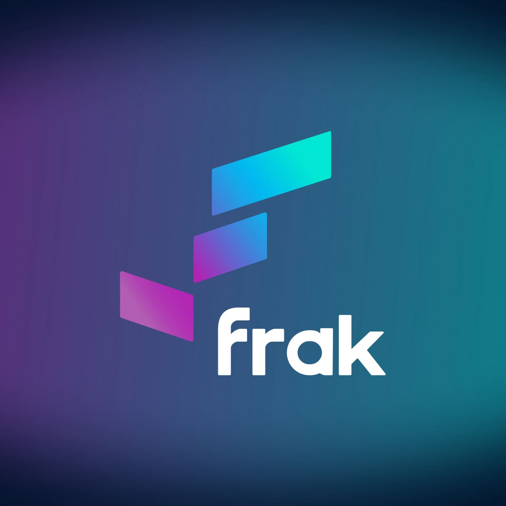

# 

# Frak.id

[](https://github.com/frak-id/frak-id-blockchain/LICENSE.txt)

[](https://github.com/frak-id/frak-id-blockchain)

[](https://github.com/frak-id/frak-id-blockchain/actions/workflows/test.yml)

[](https://www.safetin.com/audit/frak)
[](https://www.safetin.com/audit/frak-2)
[](https://docs.mythx.io/dashboard/github-badges)

This repo contains the smart contract for the [Frak.id](https://frak.id/) plateform.

It uses hardhat for deployment and upgrades, and foundry for unit test.

## Our Vision

Our vision is to give Creators the rightful place they deserve in society. The value has to be shared equally between
those who create, those who fund and those who consume content. By empowering all these people to govern and to be
rewarded for the value they create, whether that be through work, investment or engagement, the Frak ecosystem believes
that Web3 is the ideal way to make that happens.

## Installation

To install and build with [**Hardhat**](https://github.com/nomiclabs/hardhat) :

```sh
# Install
git clone https://github.com/frak-id/frak-id-blockchain.git
cd frak-id-blockchain/
pnpm i
# Build
pnpm run build
# Test
pnpm run test
forge test
```

To install with [**Foundry**](https://github.com/gakonst/foundry):

```sh
# Install
git clone https://github.com/frak-id/frak-id-blockchain.git
cd frak-id-blockchain/
# Build
forge build
```

## Contracts

```ml
minter
├─ Minter — "Mint new content, mint fraktions of content and increase fraktions supply"
├─ badges
│  ├─ FractionCostBadges — "Small contract that store the cost badges of each fraktions"
reward
├─ Rewarder — "Reward the user content consumption, from contentIds and CCU's"
├─ badges
│  ├─ ContentBadges — "Small contract storing the badges for each content's"
│  ├─ ListenerBadges — "Small contract storing the badges for each listener's"
├─ pool
│  ├─ ContentPool — "Pool that split reward gain for each content between each investor's"
│  ├─ ReferralPool — "Pool that split reward gain by each listener to each one of his referrer"
tokens
├─ FraktionTransferCallback — "Callback interface for the transfer of content fraktions"
├─ FraktionTokens — "ERC1155 storing all of our fraktions"
├─ FrakTokenL1 — "FrkToken on the ETH chain (for bridge purpose only)"
├─ FrakTokenL2 — "FrkToken on the Polygon chain"
wallets
├─ MultiVestingWallets — "Contract that handle the vestings of multiple user's"
├─ VestingWalletFactory — "Helping us with the creation of vestings following some defined criteria (initial drop, cliff etc)"
utils
├─ FrakRoles — "All the roles we use in our contracts"
├─ FrakMath — "Some math utils, to create fraktionId, or extract contentId from fraktionId."
├─ FrakAccessControlUpgradeable — "Base access control contract used by every contract"
├─ MintingAccessControlUpgradeable — "Reviewed access control contract, with more options for the minting part (so for token's and minter)"
├─ PushPullReward — "Abtract contract that implement basic Push/Pull reward (we store reward amount, then the user withdraw it), helping us gain some gas"
```

# Status

| Contract name                                                      | Status    | Audited | Deployment                                                                          |
| ------------------------------------------------------------------ | --------- | ------- | ----------------------------------------------------------------------------------- |
| [FrakToken](contracts/tokens/FrakTokenL2.sol)                      | Finalized | [^1]    | [Proxy](https://polygonscan.com/token/0x6261E4a478C98419EaFa6289509C49058D21Df8c)   |
| [FraktionTokens](contracts/tokens/FraktionTokens.sol)              | Finalized | [^2]    | [Proxy](https://polygonscan.com/token/0x4B1611803687Ab821E1b670fE94CB93303D94F8a)   |
| [VestingWalletFactory](contracts/wallets/VestingWalletFactory.sol) | Finalized | [^2]    | [Proxy](https://polygonscan.com/address/0xb8D79C7Bca3994dd5B4A80AD1c088CEBCd01f7F6) |
| [MultiVestingWallets](contracts/wallets/MultiVestingWallets.sol)   | Finalized | [^2]    | [Proxy](https://polygonscan.com/address/0x4B1611803687Ab821E1b670fE94CB93303D94F8a) |
| [Minter](contracts/minter/Minter.sol)                              | Finalized | [^2]    | [Proxy](https://polygonscan.com/address/0x1adc8CAaA35551730eCd82e0eEA683Aa90dB6cf0) |
| [Rewarder](contracts/reward/Rewarder.sol)                          | Finalized | [^2]    | [Proxy](https://polygonscan.com/address/0x8D9fa601DA1416b087E9db6B6EaD63D4920A4528) |
| [ContentPool](contracts/reward/pool/ContentPool.sol)               | Finalized | [^2]    | [Proxy](https://polygonscan.com/address/0xDCB34659B83C4F8708fd7AcAA3755547BF8BBcA0) |
| [ReferralPool](contracts/reward/pool/ReferralPool.sol)             | Finalized | [^2]    | [Proxy](https://polygonscan.com/address/0x166d8CFEe1919bC2e8c7AdBB34F1613194e9C599) |

[^1]: [Safetin - ERC20](https://www.safetin.com/audit/frak)
[^2]: [Safetin - Complete](https://www.safetin.com/audit/frak-2)

## Keep in touch

[](https://frak.id/)

[](https://help.frak.id/)

[](https://medium.com/frak-defi)

[](https://twitter.com/frak_defi)
